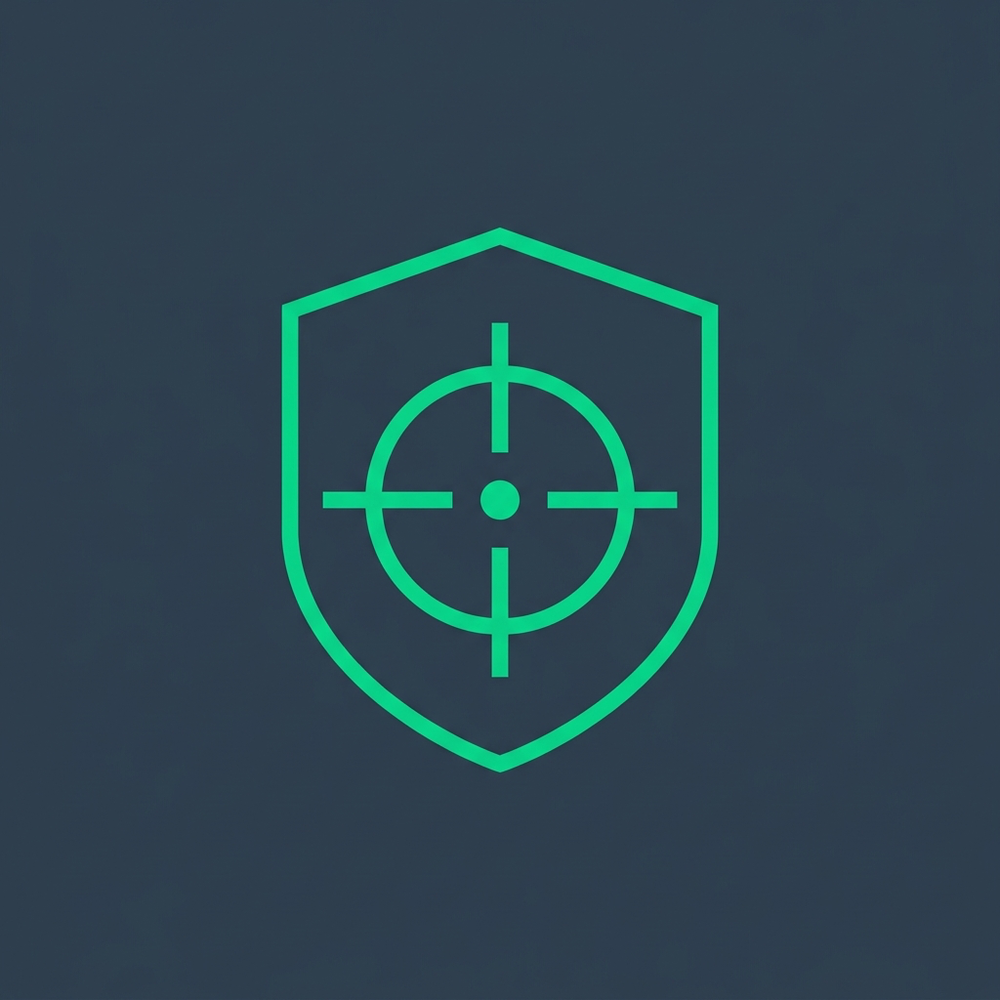
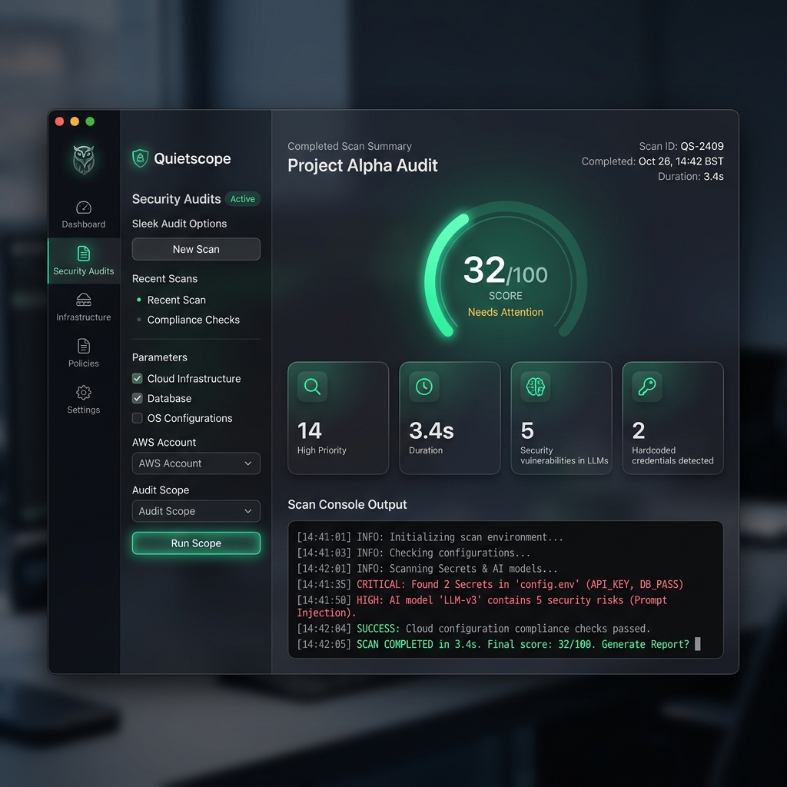
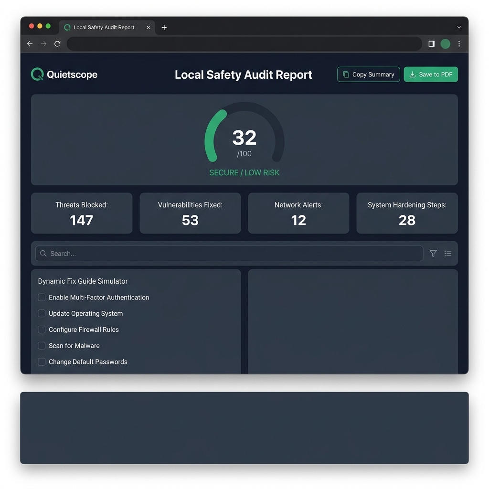

# quietscope 🛡️

<p align="center">
  
</p>

<p align="center">
  <a href="https://goreportcard.com/badge/github.com/hemp-dev/quietscope"></a>
  
  
  
</p>

**quietscope** is a premium, privacy-first, local-only defensive audit dashboard and CLI security analyzer for system security settings, storage hygiene, and local AI-agent risk surfaces.

In the era of AI coding assistants (like Cursor, Claude Code, Cline, and aider), your local filesystem is exposed to new risk vectors: malicious auto-loaded instructions (`.cursorrules`, `CLAUDE.md`), permissive local MCP server configurations, and exposed API tokens. `quietscope` inventories these risks, checks standard OS security parameters, performs safe dry-run cleanups, and generates a self-contained interactive HTML dashboard—**100% locally with zero telemetry.**

---

## 📸 Product Previews

### Native Wails Desktop Dashboard


### Self-Contained Interactive Security Report


---

> [!IMPORTANT]
> **Privacy-First Local Guarantee**
> - **Zero Telemetry:** No tracking, no phone-home, no cookies, and no third-party CDN assets.
> - **Exposed Secrets Obfuscation:** Environment variables with sensitive credentials (e.g., `ANTHROPIC_API_KEY`) are dynamically masked (`***MASKED***`) in the report DOM. We **never** read private keys, SSH files, or actual `.env` contents.
> - **Safe Execution:** All OS command evaluations pass through a strict argument-array runner without launching shell wrappers like `sh -c`.

---

## Key Features 🚀

- 🤖 **AI & MCP Agent Security Audit:** Inspects settings for Cursor, Claude Desktop/Code, Cline/Roo, aider, LM Studio, and Ollama. Flags unsafe execution permissions, remote unpinned packages, and credentials exposed in agent rules.
- 🗃️ **AI Skills & Rules Inventory:** Scans `.cursorrules`, `.cursor/rules`, `CLAUDE.md`, `AGENTS.md`, and manifests to estimate context impact and flag prompt-injection or suspicious patterns (e.g., attempts to read `~/.ssh` or bypass system rules).
- 🛡️ **System Security Audit:** Audits SIP, Gatekeeper, FileVault, sharing services, SSH configurations, cron persistence, and OS auto-updates (fully optimized for macOS; initial modules for Linux systemd/sudoers and Windows Defender/UAC).
- 🧹 **Storage Hygiene & Safe Cleanup:** Scans system logs, caches, Xcode DerivedData, simulator footprints, and package manager wastes. Provides a safe dry-run first and requires explicit verification to delete anything.
- 🌐 **Local Web Controller & HTML UI:** Runs a local control server (`127.0.0.1` only) to configure, execute, and view beautifully structured interactive audits.
- 🎨 **Wails Desktop Application:** Developer preview of a fully native, glassmorphic cross-platform GUI wrapper.

---

## Quick Start ⏱️

### 1. Build from Source (Requires Go 1.22+)
```bash
# Clone the repository
git clone https://github.com/hemp-dev/quietscope.git
cd quietscope

# Build CLI core
go build -o quietscope ./cmd/quietscope
```

### 2. Run an Audit and Open the Interactive Report
```bash
# Run a safe, non-root system & AI audit generating all report formats
./quietscope --all-reports --no-sudo

# Open the self-contained local HTML report
open ~/Desktop/quietscope-desktop-audit-*/report.html
```

### 3. Launch the Audit Control UI in Browser
```bash
# Start the local controller on localhost:8080
./quietscope --ui
```

---

## CLI Reference & Flags ⌨️

| Command Flag | Description | Default / Details |
| :--- | :--- | :--- |
| `--all-reports` | Save TXT, JSON, and HTML reports in the output directory. | Enabled by default |
| `--ui` | Start local audit control UI on a local loopback server. | `127.0.0.1:8080` only |
| `--deep` | Enable deeper security scan of project file contents. | Off |
| `--no-sudo` | Do not invoke or request sudo permissions. | Recommended for daily scans |
| `--clean-dry-run` | List cleanable system caches and logs without deleting anything. | Safe dry-run |
| `--clean-confirm` | Execute cleanup (requires typing interactive safety phrase). | Interactive only |
| `--output DIR` | Custom directory to save generated reports. | `~/Desktop` |
| `--project-root DIR` | Scan an additional local codebase for risky `.cursorrules` files. | Optional |
| `--max-file-size-mb N` | Limit size of scanned text files in Megabytes. | `5` |
| `--version` | Print quietscope version. | - |

---

## Platform Support Matrix 🖥️

| Operating System | Support Level | Core Scans Available |
| :--- | :--- | :--- |
| 🍏 **macOS (Darwin)** | **Full (Primary)** | SIP, Gatekeeper, FileVault, launchd persistence, permissions, cache cleanup, AI/MCP audit, interactive HTML. |
| 🐧 **Linux** | **Initial Support** | systemd units, cron paths, SSH/sudoers metadata, autostart entries, cache dry-run, AI/MCP audit. |
| 🪟 **Windows** | **Basic Support** | Defender, Firewall, UAC status, startup folder registries, local model inventory, basic reports. |

---

## Desktop Application (Wails Developer Preview) 🎨

We are building a beautiful native desktop app using Wails. To compile and test it:

1. Install Wails CLI:
   ```bash
   go install github.com/wailsapp/wails/v2/cmd/wails@latest
   ```
2. Navigate to `desktop/` and run dev hot-reloading:
   ```bash
   cd desktop
   wails dev
   ```
3. To compile a native production binary:
   ```bash
   wails build
   ```

---

## Contributing 🤝

Contributions are welcome! Please read [CONTRIBUTING.md](./CONTRIBUTING.md) to learn how to add new security checks, write cross-platform checks, or improve the Wails UI.

---

## License 📄

This project is licensed under the MIT License - see the [LICENSE](./LICENSE) file for details.
