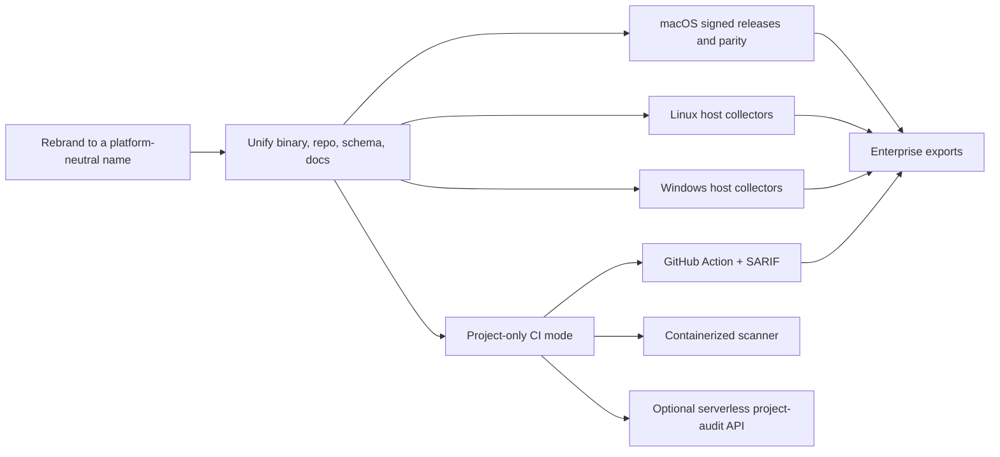
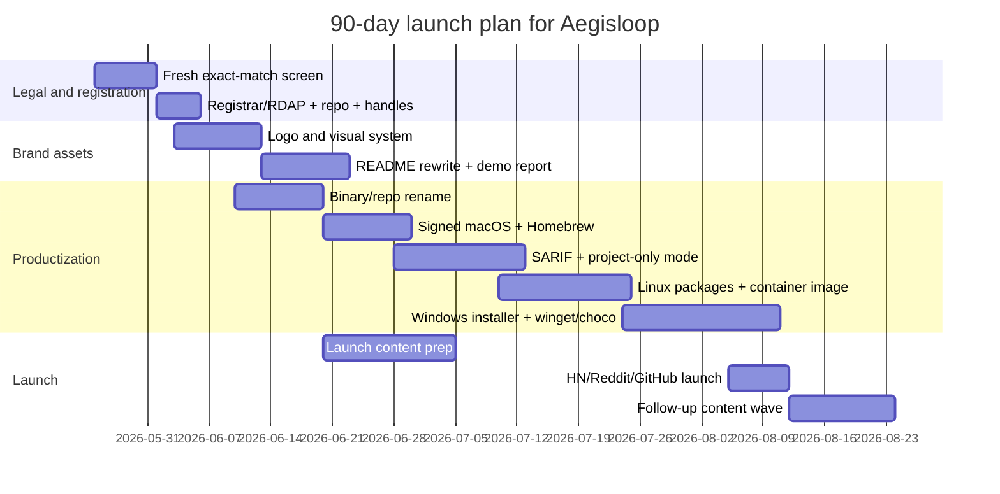

# Brand Naming Research for a Cross-Platform Local-First AI Audit Project

## Executive summary

The current project began life as `macos-security-audit`: a privacy-first, local-only macOS audit dashboard for security posture, storage hygiene, and AI-agent attack surface. The README also makes two things clear: first, the trust model is a core product asset because the tool avoids telemetry, cloud upload, and secret-value reads; second, the published roadmap is still visibly macOS-shaped, with signed macOS artifacts, TCC analysis, more MCP heuristics, and optional enterprise exports. That is exactly why the next brand should stop signaling “Mac utility” and start signaling “cross-platform trust visibility.” fileciteturn0file0

My recommended name is **Aegisloop**. It is the strongest balance of distinctiveness, cross-platform stretch, technical credibility, and low apparent exact-match collision risk from this screen. The best alternatives, in descending order, are **Trustplane**, **Scopevault**, **Quietscope**, and **Isolattice**.

This is a **screening report, not legal clearance**. I treated domain status as a WHOIS/registrar problem, because registrar WHOIS tools explicitly frame availability and ownership lookup that way, then I layered exact-match public-web, GitHub, and trademark-database screening over the top. Where the browser could not produce a citeable no-result page, I mark status as **NI/U**: **no indexed exact-match surfaced; authoritative registrar/RDAP state unspecified in-browser**. citeturn2search4turn3search4

## Research method and caveats

I used a conservative, brand-first screen on **May 24, 2026**. The workflow was simple: exact-match public-web search for obvious conflicts, exact-match screening for repository/project conflicts, and exact-match checks in the main trademark search surfaces referenced in your brief. The goal was not to “prove availability,” which is impossible from a research interface alone; it was to **remove names that already look used, generic, or legally crowded**, and then rank the survivors by how well they can stretch from a local workstation scanner to Linux, Windows, and CI/project-only modes.

The method is useful because it actually catches attractive-but-bad options. Two examples that would have failed your “original, non-duplicative” requirement are **Pathward** and **Veriscope**, both of which already surface as established names on the public web. That is the sort of avoidable collision this report is designed to eliminate early. citeturn9search0turn17search0

The weakest part of any naming screen is domain verification. WHOIS/registrar tools are the right primary source for domain ownership and availability, but the browser here does not reliably expose deep-linkable no-result states for every candidate/TLD combination. That is why domain cells below are deliberately phrased as **preliminary**. If you move on a name, do a same-day registrar/RDAP pass before publishing anything public. citeturn2search4turn3search4

## Ranked candidate list

The names below are all **coined compounds** that survived the screen. I favored compounds because they were materially easier to make distinctive than pure dictionary words. Scores are directional: **Mem** = memorability, **Pron** = pronounceability, **Fit** = semantic fit to the product, all on a 1–5 scale. Domain cells use **NI/U** as defined above. citeturn2search4turn3search4

| Rank | Candidate | Meaning and etymology | Tone | Mem | Pron | Fit | Potential negative connotations | Domain status | Likely GitHub repo availability | Preliminary TM risk | Scales beyond macOS |
|---|---|---|---|---:|---:|---:|---|---|---|---|---|
| 1 | **Aegisloop** | *Aegis* + *loop*; a protective loop around local trust and execution paths | Technical | 5 | 4 | 5 | “Aegis” is security-coded; “loop” can imply automation loops or endless cycles | `.com NI/U · .dev NI/U · .ai NI/U · .sh NI/U` | Likely available | Low | Excellent |
| 2 | **Trustplane** | *Trust* + *plane*; the layer where access, tools, and context interact | Enterprise | 4 | 5 | 5 | Slightly abstract; may sound platform-heavy | `.com NI/U · .dev NI/U · .ai NI/U · .sh NI/U` | Likely available | Low–Med | Excellent |
| 3 | **Scopevault** | *Scope* + *vault*; safe visibility into what is reachable and exposed | Technical | 4 | 5 | 5 | Can skew toward storage or backup semantics | `.com NI/U · .dev NI/U · .ai NI/U · .sh NI/U` | Likely available | Low–Med | Excellent |
| 4 | **Quietscope** | *Quiet* + *scope*; silent, local observability without leakage | Friendly-technical | 4 | 5 | 4 | May sound passive or observability-only | `.com NI/U · .dev NI/U · .ai NI/U · .sh NI/U` | Likely available | Low–Med | Excellent |
| 5 | **Isolattice** | *Isolation* + *lattice*; bounded access graph, compartments, privilege edges | Technical | 4 | 4 | 5 | Academic feel; colder than the top four | `.com NI/U · .dev NI/U · .ai NI/U · .sh NI/U` | Likely available | Low | Excellent |
| 6 | **Lociscope** | *Loci* + *scope*; map local surfaces and trust zones | Technical | 4 | 4 | 4 | Pronunciation ambiguity: “LOH-ci” vs “LOE-ci” | `.com NI/U · .dev NI/U · .ai NI/U · .sh NI/U` | Likely available | Low | Excellent |
| 7 | **Locivault** | *Loci* + *vault*; local-first protected inventory | Technical | 3 | 4 | 4 | Feels more storage-first than security-first | `.com NI/U · .dev NI/U · .ai NI/U · .sh NI/U` | Likely available | Low | Excellent |
| 8 | **Toolward** | *Tool* + *ward*; guard the tools an agent may reach | Friendly | 4 | 5 | 4 | Too tool-centric if the brand grows into broader posture management | `.com NI/U · .dev NI/U · .ai NI/U · .sh NI/U` | Likely available | Low | Excellent |
| 9 | **Hushgrid** | *Hush* + *grid*; quiet boundaries across a local system grid | Friendly-technical | 4 | 5 | 4 | “Hush” can imply secrecy or suppression | `.com NI/U · .dev NI/U · .ai NI/U · .sh NI/U` | Likely available | Low | Excellent |
| 10 | **Tooltrace** | *Tool* + *trace*; trace reachable tools, commands, and side effects | Technical | 4 | 5 | 4 | Leans forensic/observability more than posture | `.com NI/U · .dev NI/U · .ai NI/U · .sh NI/U` | Likely available | Low | Excellent |

| Rank | Candidate | Meaning and etymology | Tone | Mem | Pron | Fit | Potential negative connotations | Domain status | Likely GitHub repo availability | Preliminary TM risk | Scales beyond macOS |
|---|---|---|---|---:|---:|---:|---|---|---|---|---|
| 11 | **Contextforge** | *Context* + *forge*; shape and inspect the hidden context that drives behavior | Technical | 3 | 5 | 5 | “Forge” implies creation more than audit | `.com NI/U · .dev NI/U · .ai NI/U · .sh NI/U` | Likely available | Low | Good |
| 12 | **Promptveil** | *Prompt* + *veil*; hidden instruction layers and masked trust boundaries | Technical | 4 | 5 | 4 | Too prompt-specific if product expands beyond AI context | `.com NI/U · .dev NI/U · .ai NI/U · .sh NI/U` | Likely available | Low | Good |
| 13 | **Prismward** | *Prism* + *ward*; multi-angle visibility with protection | Enterprise | 4 | 5 | 4 | “Prism” is crowded in analytics/security naming | `.com NI/U · .dev NI/U · .ai NI/U · .sh NI/U` | Likely available | Med | Excellent |
| 14 | **Proofnest** | *Proof* + *nest*; a place where evidence collects | Friendly | 3 | 5 | 4 | Slightly consumerish; softer than the product’s security posture | `.com NI/U · .dev NI/U · .ai NI/U · .sh NI/U` | Likely available | Low | Good |
| 15 | **Siftward** | *Sift* + *ward*; filter, then guard | Technical | 4 | 4 | 4 | Not instantly self-explanatory | `.com NI/U · .dev NI/U · .ai NI/U · .sh NI/U` | Likely available | Low | Excellent |
| 16 | **Signalnest** | *Signal* + *nest*; gather the signals that matter | Friendly | 4 | 5 | 4 | Could read like a monitoring SaaS more than a security tool | `.com NI/U · .dev NI/U · .ai NI/U · .sh NI/U` | Likely available | Low | Good |
| 17 | **Threadguard** | *Thread* + *guard*; protect instruction flows and execution threads | Enterprise | 4 | 5 | 4 | Could be confused with concurrency tooling or message threads | `.com NI/U · .dev NI/U · .ai NI/U · .sh NI/U` | Reserve early | Med | Good |
| 18 | **Configloom** | *Config* + *loom*; the configuration layer that shapes runtime behavior | Technical | 3 | 4 | 5 | “Loom” can sound ominous or textile-like | `.com NI/U · .dev NI/U · .ai NI/U · .sh NI/U` | Likely available | Low | Good |
| 19 | **Loomtrace** | *Loom* + *trace*; hidden patterns made traceable | Technical | 3 | 4 | 4 | Darker tone than necessary; less immediate | `.com NI/U · .dev NI/U · .ai NI/U · .sh NI/U` | Likely available | Low | Good |
| 20 | **Shellward** | *Shell* + *ward*; guard shell edges and execution surfaces | Technical | 3 | 5 | 4 | Unix-biased; weaker fit for Windows and browser/CI expansion | `.com NI/U · .dev NI/U · .ai NI/U · .sh NI/U` | Likely available | Low | Limited |

A few interpretation notes matter. The best-scoring names are not just the ones with the strongest security flavor; they are the ones that can still make sense when the product becomes a **Linux and Windows host scanner**, a **repo-only CI policy audit**, a **SARIF emitter**, a **GitHub Action**, or an **optional serverless project-audit API**. That is why names like **Promptveil**, **Configloom**, and especially **Shellward** rank lower despite being semantically sharp in the current product niche.

## Brand archetypes

Four archetypes emerged clearly from the screen.

| Archetype | What it signals | Best candidates | Strategic upside | Strategic downside |
|---|---|---|---|---|
| **Guard / Control-plane** | Protection, policy, trust boundaries | Aegisloop, Trustplane, Toolward, Siftward, Threadguard, Prismward | Best fit for enterprise and cross-platform stretch | Slightly colder; can drift toward generic security language |
| **Scope / Visibility** | Inspection, mapping, observability | Scopevault, Quietscope, Lociscope, Tooltrace | Best fit for local-first audit and evidence-first UX | Can undersell “security” unless messaging is sharp |
| **Privacy / Containment** | Quiet operation, local-only, minimal leakage | Isolattice, Locivault, Hushgrid, Proofnest | Best fit for your privacy-first posture | Can feel niche or too subtle for broader discovery |
| **Context / Workflow** | AI artifacts, prompts, configs, hidden instructions | Contextforge, Promptveil, Configloom, Loomtrace | Best fit if AI-agent context remains the core story | Narrower if product grows into broader host posture |

The first two archetypes are the safest long-term bets. Your README already anchors the product in a privacy-first local audit model, but it also spans classic host posture, persistence, cleanup, MCP, local LLMs, and project-level context artifacts. A master brand that sits above all of those surfaces should therefore feel more like **trust mapping** than **prompt scanning**. fileciteturn0file0

## Shortlist and recommendation

The five strongest names are below. Each can support a CLI, a hosted documentation site, a GitHub Action, and later enterprise integrations without sounding trapped in “just a Mac scanner” territory.

| Candidate | Why it works | Visual identity cues | Short tagline | Recommended repo name | Domain target |
|---|---|---|---|---|---|
| **Aegisloop** | Most distinctive and stretchable; sounds like a system, not a utility | Segmented loop forming an implied shield around a node; subtle orbit motif | **Map the local trust loop** | `aegisloop` | `aegisloop.dev` first; reserve `.sh`, `.ai`, `.com` if clear |
| **Trustplane** | Strongest enterprise narrative; good for future policy engine and integrations | Layered plane/grid with one highlighted access path | **See the plane of local trust** | `trustplane` | `trustplane.dev` |
| **Scopevault** | Best “safe visibility” story; ideal if privacy-first remains central | Aperture or lens nested inside a vault outline | **Safe visibility for agent surfaces** | `scopevault` | `scopevault.dev` |
| **Quietscope** | Best friendly technical name; excellent for markdown-heavy OSS positioning | Minimal concentric rings, muted signal iconography | **Visibility without leakage** | `quietscope` | `quietscope.dev` |
| **Isolattice** | Deepest technical credibility; strong for Linux/Windows/CI/enterprise scale | Lattice grid with one isolated active cell | **Map boundaries before agents cross them** | `isolattice` | `isolattice.dev` |

My recommendation is **Aegisloop**.

It wins because it is the most **brandable** of the five without losing the meaning you need. It is not a generic security noun. It does not lock you to one platform, one artifact type, or one feature set. It is distinctive enough to serve as both an open-source repo name and a future umbrella for distributions, modules, or enterprise add-ons. It also leaves room for crisp product line naming later, for example: **Aegisloop Host Audit**, **Aegisloop Project Audit**, **Aegisloop Action**, **Aegisloop SARIF**, and **Aegisloop Policy**.

If you want a more conservative, enterprise-facing tone, choose **Trustplane**. If you want the strongest privacy-first emotional signal, choose **Quietscope**. If you want the strongest “evidence-first inspection” metaphor, choose **Scopevault**.

## Naming rules and forbidden patterns

A good name for this product family should follow a few hard rules.

First, do **not** put the platform in the master brand. The current codebase name is macOS-specific, but the roadmap should not be. A Mac-prefixed brand becomes a liability the moment Linux, Windows, GitHub Action mode, or a serverless repo-audit API ships. The platform can live in docs, install paths, and subcommands, not in the brand.

Second, prefer **coined compounds** over dictionary words. The best compounds in this screen combine one **trust/visibility root** and one **systems/workflow root**. That gives enough semantics for memory, while still staying distinct enough for legal and SEO screening.

Third, keep the name **speakable**. The sweet spot here is generally two to four syllables and roughly eight to eleven characters. If a maintainer cannot say it clearly in a podcast intro or a conference hallway, it loses a lot of brand value.

Fourth, avoid names that overfit the current niche. Your README is broader than MCP or prompts alone; it already covers system posture, persistence, permissions, storage hygiene, AI tool inventories, local LLM artifacts, and project-level context surfaces. A brand that says “prompt” or “shell” too loudly will age faster than the product. fileciteturn0file0

The biggest forbidden patterns are straightforward:

| Avoid this pattern | Why it is a mistake |
|---|---|
| **`mac*`, `osx*`, `apple*`** | Hard limits cross-platform expansion and enterprise packaging |
| **`*audit`, `*scanner`, `*security` as the whole brand** | Too descriptive, weak as a trademark, forgettable, crowded |
| **`agent*`, `llm*`, `mcp*` in the master brand** | Too category-bound; better as module names |
| **Pure dictionary words like “Guard”, “Vault”, “Scope” alone** | Too crowded and trademark-risky |
| **Fear words like “spy”, “sniff”, “stalk”, “worm”, “parasite”** | Damages trust for a privacy-first OSS tool |
| **Overly Unix-specific words** | Weak fit once Windows support appears |

The screen also suggests one more rule: if a name surfaces as an established entity, drop it immediately, even if it sounds good. **Pathward** and **Veriscope** are exactly the kind of attractive-but-bad names that should be ruled out on day one. citeturn9search0turn17search0

## Roadmap and launch checklist

The README’s current roadmap is a good engineering start, but it is still anchored to the current shape of the project: signed macOS arm64/amd64 releases, optional Rust helper components, richer TCC analysis, more MCP schema work, and enterprise profile exports. The same README also makes clear that installation is currently build-from-source only, with no Homebrew or other package ecosystem in place. A rebrand is therefore the right moment to make the roadmap **explicitly cross-platform** and **packaging-aware**. fileciteturn0file0

A brand-neutral roadmap should look like this:

| Workstream | Immediate scope | Next platform milestone | Packaging and distribution | Enterprise / ecosystem |
|---|---|---|---|---|
| **Core CLI and naming** | Rename binary, repo, JSON schema, docs, screenshots | Abstract host collectors behind platform modules | Unified binary/package name across all channels | Stable schema contracts for downstream integrations |
| **macOS host audit** | Keep parity with existing checks; signed releases | Harden parser reliability and note platform-specific limits | Homebrew formula, signed and checksummed artifacts | Jamf-friendly export profile, local bundle reports |
| **Linux host audit** | User services, systemd, shell rc files, package manager footprints, sockets, SSH/config perms | Add distro adapters and privilege-aware collectors | `.deb` and `apt` repo, Snap package, tarball releases | SIEM-friendly collectors, fleet-safe non-root mode |
| **Windows host audit** | Run keys, Scheduled Tasks, Services, PowerShell profiles, WSL, local listeners, firewall posture | Add Defender posture and agent-artifact discovery | MSI or EXE installer, Winget manifest, Chocolatey package | Intune/SCCM-friendly exports, event-log mapping |
| **Project-only mode** | Repo-local AI instruction audit, MCP files, rules, suspicious patterns | Cross-platform by default because host access is not required | Containerized scanner image, GitHub Action | Optional serverless project-audit API, SARIF upload |
| **Report and policy outputs** | JSON + HTML parity | Cross-platform schema stability | SARIF, SPDX/SBOM-adjacent metadata, signed checksums | Splunk/Elastic/DefectDojo connectors |
| **Trust and signing** | Checksums, signatures, reproducible builds | Sigstore/cosign or equivalent provenance | Signed macOS/Linux/Windows artifacts | Policy attestation and enterprise ingest |

The names that scale best across that roadmap are **Aegisloop**, **Trustplane**, **Scopevault**, **Quietscope**, and **Isolattice**. The weakest scaling names are **Shellward** because it is OS-flavored, plus **Promptveil** and **Configloom** because they overweight one feature layer of the product.

For the chosen name, the first 90 days should be handled as a launch program, not a cosmetic rename:

| Time window | Critical actions |
|---|---|
| **Days 1–10** | Re-run exact-match searches the day you commit; perform fresh registrar/RDAP checks; register primary domain, GitHub org/repo, package identifiers, and social handles; save screenshots of every search result for internal records |
| **Days 11–20** | Finalize logo, favicon, terminal screenshot style, open-graph card, and concise brand narrative; choose canonical package name; add a “formerly macos-security-audit” bridge note |
| **Days 21–35** | Rename repo and binary; add CLI alias/deprecation path; rewrite README hero, install docs, and demo report; create one redacted demo HTML report and one demo JSON file |
| **Days 36–50** | Ship signed macOS artifacts; add Homebrew formula; stabilize JSON schema; add SARIF output for project-only mode |
| **Days 51–65** | Ship Linux tarballs plus `.deb`/`apt` path; add containerized project-only scanner; publish GitHub Action |
| **Days 66–80** | Ship Windows installer, Winget manifest, Chocolatey package; document platform-specific collectors and limitations |
| **Days 81–90** | Launch on Hacker News, relevant Reddit communities, GitHub, and technical blog; publish two technical essays: one on local AI-agent trust surfaces, one on privacy-first local auditing; monitor feedback and reserve follow-on package names |

One final caution is worth making explicit. **Do not publish the brand until you have done the same-day legal refresh** on the chosen name: exact-match and phonetic searches, class-adjacent checks, registrar/RDAP verification, GitHub repo reservation, and at least a basic counsel review if you plan to commercialize later. This report narrows the field aggressively and usefully, but it should be treated as the **last research screen before formal clearance**, not a substitute for it.